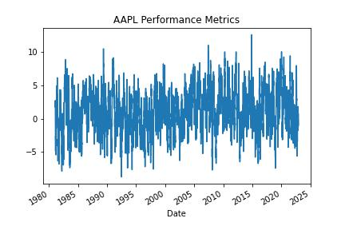
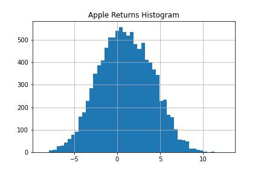
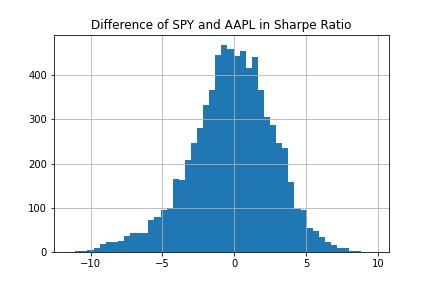

# Sharpe ratio for risk-adjusted returns

The most popular performance metric in investing is the Sharpe ratio!

The Sharpe ratio tells you the "risk-adjusted" return of an investment. In other words, "how much return do you get for every unit of risk you take." It’s a great way to compare strategies because it normalizes their returns by risk.

If you’re investing or trading, you might want to consider the Sharpe ratio as one of your performance metrics.

### Without considering the Sharpe ratio, you miss important information about the performance.
**Here’s an example:**

    Stock A returned 20%
    
    Stock B returned 25%
    
Which is the better investment?

You’re going to say Stock B because it returned more. What if I told you Stock A has 10% volatility and Stock B has 70% volatility? Then it’s not so clear. The Sharpe ratio takes this into account. A Sharpe ratio over 1 is generally considered "good."

Key takeaways:

How to get stock price data
How to compute the Sharpe ratio
How to compare two investment options

---

Libraries used: 

yfinance for getting stock data
yfinance

NumPy for vectorizing outputs.
numpy

matplotlib

---

## Step 1: Get the data

Use the yFinance library to get data

For this example we will work with the SPY and AAPL adjusted closing price using the built in pct_change() function

---

## Step 2: Compute the Sharpe Ratio

Create a function for the Sharpe Ratio

The function takes a series of daily returns and subtracts an adjustment factor. 

In the original work by William Sharpe, the adjustment factor was the risk-free rate. 
(Since the risk-free rate has been near 0 for almost a decade, it is not considered in the analysis.)

The function divides the mean return by the standard deviation of return. 
Since the function accepts daily returns, you can annualize it by multiplying by the square root of the number of trading days in the year.

---

## Step 3: Compare investment options

Compute the Sharpe Ratio for AAPL and SPY.

The Sharpe ratio for AAPL is higher than for SPY. That means you have more return for every unit of risk and might be considered "better."

It’s always useful to look at performance metrics through time because they are never static.

Plot *aapl_returns*

---

Use a histogram to visualize the distribution of rolling Sharpe ratios. 

In the case of AAPL, there is a long tail of positive Sharpe ratios.

Plot histogram of *aapl_returns*

---

Subtract the SPY Sharpe ratio from the AAPL Sharpe ratio and plot the result as a histogram.

Histogram of difference between SPY and AAPL sharpe ratio

AAPL does not consistently beat SPY over every 30-day period. However, by the analysis above, you’re safe to conclude based on risk-adjusted returns, it was a better investment.